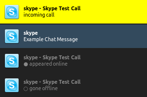

# skype-notify

A simple bash script for displaying skype notifications via libnotify and your notification deamon.  
An example with "dunst" and the Faenza icon theme:  

Currently, four events are handled: Incoming calls, incoming chat messages, and contacts going online/offline.

## Usage

1. Realise that you still need skype and mourn silently for 10 seconds.

2. Clone this repo somewhere.  
`git clone https://github.com/lathan/skype-notify.git`

3. Open skype. Go to "options" (`CTRL+o`). Select the "Notifications" tab. Click "Advanced View"

4. Check the box that says "Execute the following script on any event:". In its input field you need to enter the following:  
`<path_to_script>/skype-notify.sh "%type" "%sskype" "%sname" "%smessage" "%fname" "%fpath" "%fsize`  
So, if for example you cloned this repo inside `~/git`, the above should look like:  
`~/git/skype-notify/skype-notify.sh "%type" "%sskype" "%sname" "%smessage" "%fname" "%fpath" "%fsize"`

5. From the list of notifications, select "Chat Message Received", press "Test Event". You should now see a notification pop up in your environment's native notification daemon. Bellow is an artist's rendition of what that might look like.  

6. Optionally, disable skype's pop-up notifications for events that you only want to be displayed by `skype-notify`.

7. Skype has now been made less terrible. Rejoice at this realization.

## Hot Strings

Sometimes things break. And then your boss is all like "Hey George, the site is fucked!". You can tell `skype-notify` to raise the urgency of a notification to 'critical' when it detects certain strings, like 'george' or 'fuck'. You can specify one case insensitive string per line in in the file `~/.config/skype-notify.strings`.

## Requirements

`skype-notify` requires [libnotify](https://developer.gnome.org/notification-spec/).
